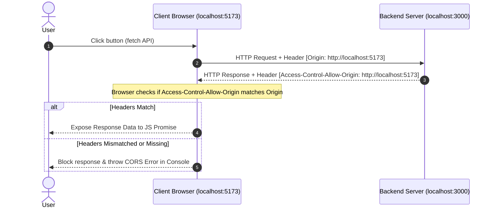
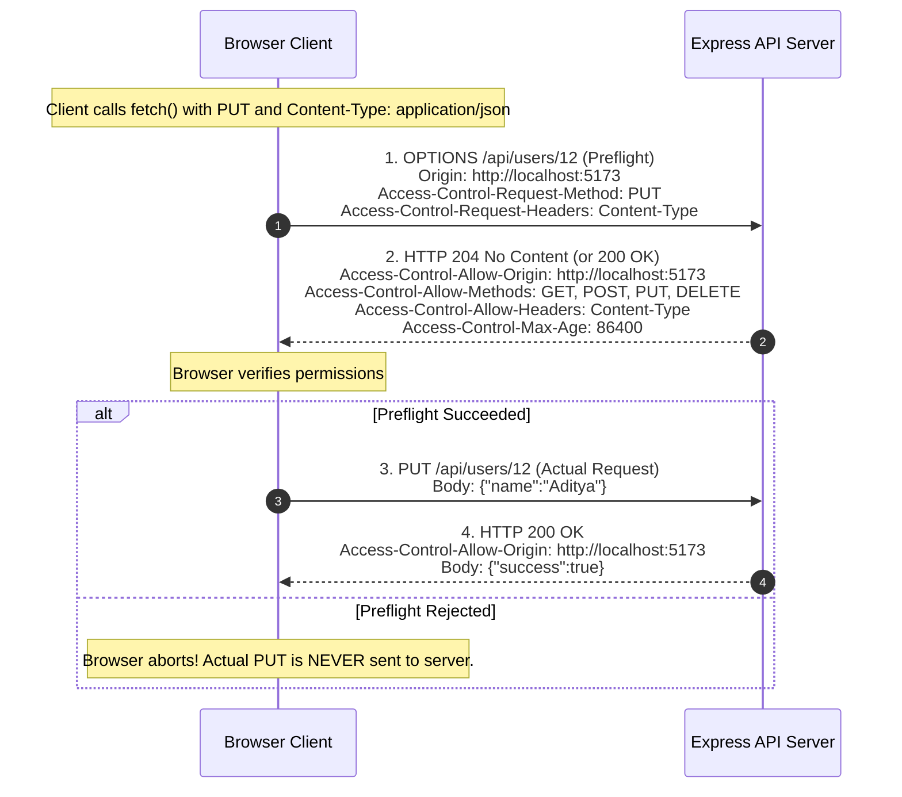

# CORS Internal Mechanisms and HTTP Protocol Deep-Dive

## 1. Introduction

In the practical guide, we learned how to install and configure the Express `cors` middleware. However, senior backend engineers must understand **how CORS operates at the HTTP protocol layer**, how browsers enforce it, what triggers preflight requests, and how HTTP headers govern the entire cross-origin communication lifecycle.

---

## 2. The Same-Origin Policy (SOP)

CORS is an extension and controlled relaxation of the **Same-Origin Policy (SOP)**—a fundamental browser security model introduced by Netscape in 1995.

### What Defines an Origin?
An origin is defined strictly by the tuple:
$$\text{Origin} = \text{Scheme (Protocol)} + \text{Host (Domain)} + \text{Port}$$

Let us compare various URLs against the reference origin `http://example.com:80`:

| Target URL | Same Origin? | Reason |
| :--- | :--- | :--- |
| `http://example.com/api/users` | **YES** | Identical scheme (`http`), host (`example.com`), and default port (`80`) |
| `http://example.com/blog/posts` | **YES** | Only path differs; origin is unchanged |
| `https://example.com/api/users` | **NO** | Different scheme (`https` vs `http`) |
| `http://api.example.com/users` | **NO** | Different host (subdomain `api.example.com` vs `example.com`) |
| `http://example.com:3000/users` | **NO** | Different port (`3000` vs `80`) |

Under the Same-Origin Policy, JavaScript executing on `http://localhost:5173` is strictly blocked by the browser from inspecting the HTTP response body received from `http://localhost:3000`, unless the receiving server explicitly supplies CORS permission headers.

---

## 3. Protocol-Level Request & Response Headers

CORS operates entirely through HTTP request and response headers negotiated between the browser client and the server.



### 3.1 The `Origin` Request Header
Whenever a web page makes a cross-origin `fetch` or `XMLHttpRequest`, the browser **automatically** appends the `Origin` header.

```http
GET /api/products HTTP/1.1
Host: localhost:3000
Origin: http://localhost:5173
User-Agent: Mozilla/5.0 ...
```

> [!NOTE]
> Web applications cannot modify or spoof the `Origin` header using JavaScript. The browser engine exclusively sets this header to guarantee its authenticity.

### 3.2 Key CORS Response Headers

| Header | Description | Example |
| :--- | :--- | :--- |
| `Access-Control-Allow-Origin` | Specifies permitted requesting origins. | `http://localhost:5173` or `*` |
| `Access-Control-Allow-Methods` | Permitted HTTP verbs for preflight checks. | `GET, POST, PUT, DELETE, OPTIONS` |
| `Access-Control-Allow-Headers` | Permitted custom client headers. | `Content-Type, Authorization, X-Requested-With` |
| `Access-Control-Allow-Credentials` | Informs browser if cookies/auth tokens may be exposed. | `true` |
| `Access-Control-Max-Age` | How long (in seconds) the browser may cache a preflight result. | `86400` (24 hours) |
| `Access-Control-Expose-Headers` | Whitelists custom response headers that JS is allowed to read. | `X-Total-Count, X-Custom-Token` |

---

## 4. Simple Requests vs. Non-Simple Requests

The W3C / WHATWG specification categorizes all cross-origin requests into two distinct groups:

### 4.1 Simple Requests
A request is classified as **Simple** if it satisfies **all** of the following conditions:
1. **HTTP Method**: Must be one of `GET`, `POST`, or `HEAD`.
2. **Permitted Headers**: Only standard browser-controlled headers (such as `Accept`, `Accept-Language`, `Content-Language`, or `User-Agent`).
3. **Content-Type**: Only one of the three legacy formats:
   - `application/x-www-form-urlencoded`
   - `multipart/form-data`
   - `text/plain`
4. No event listeners are registered on any `XMLHttpRequestUpload` object.

**How Simple Requests Behave:**
The browser sends the actual HTTP request immediately without any preliminary handshake. When the response arrives, the browser inspects `Access-Control-Allow-Origin`. If valid, JavaScript receives the data; otherwise, the browser conceals the response.

---

### 4.2 Non-Simple Requests
A request is classified as **Non-Simple** if it meets **any** of these criteria:
- Uses methods other than GET/POST/HEAD: `PUT`, `PATCH`, `DELETE`.
- Sends custom headers (e.g. `Authorization: Bearer <token>`, `X-Api-Key: xyz`).
- Sends a `Content-Type` of **`application/json`**!

> [!IMPORTANT]
> **Why `application/json` Triggers Preflight:**
> In early web specifications, HTML forms could only submit `application/x-www-form-urlencoded` or `multipart/form-data`. Because an HTML form could never send raw `application/json` across origins, browsers created the preflight check to ensure modern JSON APIs intentionally consent before processing potentially destructive payloads.

---

## 5. The Preflight Handshake (`OPTIONS` Method)

When a non-simple request is triggered, the browser intercepts it and performs a **two-step handshake**:



### Preflight Request Headers Sent by Browser
- `OPTIONS /api/users/12 HTTP/1.1`
- `Origin: http://localhost:5173`
- `Access-Control-Request-Method: PUT`: "I intend to send a PUT request next."
- `Access-Control-Request-Headers: Content-Type, Authorization`: "I intend to send these headers."

### Preflight Response Headers Sent by Server
- `HTTP/1.1 204 No Content`
- `Access-Control-Allow-Origin: http://localhost:5173`
- `Access-Control-Allow-Methods: GET, POST, PUT, DELETE, OPTIONS`
- `Access-Control-Allow-Headers: Content-Type, Authorization`
- `Access-Control-Max-Age: 86400` (Caches preflight result so future requests don't repeat `OPTIONS`)

---

## 6. Manual CORS Implementation (Without `cors` Package)

To truly understand how CORS works, observe how Express handles it manually using raw HTTP headers:

```javascript
const express = require("express");
const app = express();

// Custom CORS Middleware from Scratch
app.use((req, res, next) => {
  const allowedOrigins = ["http://localhost:5173", "https://codinggita.com"];
  const origin = req.headers.origin;

  if (allowedOrigins.includes(origin)) {
    res.setHeader("Access-Control-Allow-Origin", origin);
  }

  res.setHeader("Access-Control-Allow-Methods", "GET, POST, PUT, PATCH, DELETE, OPTIONS");
  res.setHeader("Access-Control-Allow-Headers", "Content-Type, Authorization");
  res.setHeader("Access-Control-Allow-Credentials", "true");
  res.setHeader("Access-Control-Max-Age", "86400"); // 24 hours

  // Intercept and resolve Preflight OPTIONS requests immediately
  if (req.method === "OPTIONS") {
    return res.status(204).end();
  }

  next();
});

app.use(express.json());

app.get("/api/data", (req, res) => {
  res.json({ message: "CORS manually configured!" });
});

app.listen(3000, () => console.log("Server listening on port 3000"));
```

The popular `cors` npm package encapsulates this exact logic, along with edge-case handling and standard regex pattern matching.

---

## 7. What CORS Does NOT Protect (Crucial Architectural Insight)

A very common beginner fallacy is believing: *"CORS protects my server from malicious hackers."*

> [!CAUTION]
> **CORS is NOT backend security!**
> 1. **CORS is enforced by web browsers only.**
> 2. A hacker using Python `requests`, Node.js `axios`, Postman, or `curl` can send any HTTP verb with any headers directly to your server:
>    ```bash
>    curl -X DELETE http://localhost:3000/api/users/12
>    ```
>    The server executes the delete command without any browser intervention.
> 3. True backend protection requires:
>    - Cryptographic authentication (JWT, sessions)
>    - Role-based authorization
>    - Input validation and sanitization
>    - Rate limiting and WAFs (Web Application Firewalls)

---

## 8. Inspecting CORS in Chrome DevTools

When debugging CORS errors:
1. Open Chrome DevTools (`F12` or `Cmd + Option + I`).
2. Navigate to the **Network** tab.
3. Filter by **Fetch/XHR**.
4. Check if you see **two requests** for a single action:
   - First request: Method is `OPTIONS`, status code is `204` or `200`.
   - Second request: Method is `POST`/`PUT`/`DELETE`.
5. If the `OPTIONS` request returns a `404` or `405`, your server does not support preflight for that route.
6. Inspect the **Response Headers** of the failed request to verify whether `Access-Control-Allow-Origin` matches your client's exact protocol, host, and port.

---

## 9. Practice Questions

1. If origin `http://myapp.com:8080` calls `http://myapp.com:9090`, does this trigger CORS? Why or why not?
2. Why does a preflight request use HTTP status `204 No Content` instead of `200 OK`?
3. What is the purpose of the `Access-Control-Max-Age` header, and how does it optimize network performance?
4. What happens if a server returns `Access-Control-Allow-Origin: *` to a request that included `credentials: 'include'`?

---

## 10. Hands-On Verification Exercise

1. Launch an Express server on port `4000` with the custom manual CORS middleware from Section 6.
2. Send a `curl` request:
   ```bash
   curl -I -X OPTIONS http://localhost:4000/api/data -H "Origin: http://localhost:5173" -H "Access-Control-Request-Method: PUT"
   ```
3. Verify that the server responds with:
   - `HTTP/1.1 204 No Content`
   - `Access-Control-Allow-Origin: http://localhost:5173`
   - `Access-Control-Allow-Methods: ...`

---

## 11. Interview Questions & Model Answers

### Q1: Explain step-by-step what happens during an HTTP preflight request.
**Answer:**
1. The browser recognizes that an outgoing request is non-simple (e.g. method is `DELETE`, or `Content-Type` is `application/json`, or custom authorization headers are present).
2. Before sending the actual request, the browser creates an HTTP `OPTIONS` request to the target URI.
3. It attaches `Origin`, `Access-Control-Request-Method`, and `Access-Control-Request-Headers`.
4. The backend server checks if the requested origin, method, and headers are allowed.
5. If allowed, the server responds with status `204 No Content` and matching `Access-Control-Allow-*` headers.
6. Upon validating this response, the browser immediately dispatches the actual request. If the server fails to permit any of the requested criteria, the browser terminates the process and emits a CORS error to the console without sending the actual payload.

### Q2: What is the purpose of `Access-Control-Expose-Headers`?
**Answer:**
By default, the browser only exposes basic response headers (such as `Cache-Control`, `Content-Language`, `Content-Type`, `Expires`, `Last-Modified`, `Pragma`) to client-side JavaScript (`response.headers.get(...)`). If the backend returns custom metadata headers—such as `X-Total-Count` (for pagination) or `X-Refresh-Token`—JavaScript cannot read them unless the server explicitly white-lists them using:
`Access-Control-Expose-Headers: X-Total-Count, X-Refresh-Token`.
